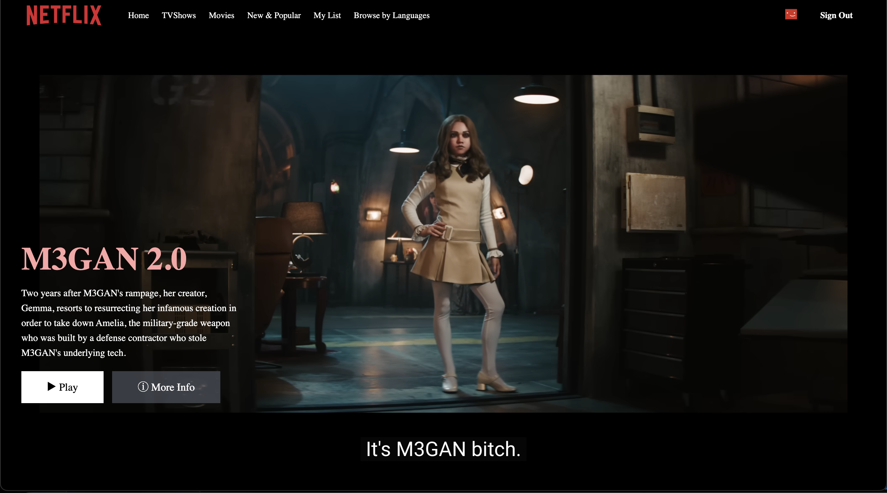

# NetflixNow

NetflixNow is a responsive frontend web application that replicates core Netflix features including user authentication, movie browsing and dynamic UI interactions. 

Users can explore a wide range of movie categories including Now Playing, Trending, Top Rated, Action, Sci Fi, Drama, Horror, Thriller and Comedy. The Browse page features an auto playing cinematic background trailer, creating an immersive, Netflix like viewing experience.
The app is built using React JS, Redux and Tailwind CSS.

## Login Page UI


## Browse Page UI



## Key Features
- Sign up / Sign in flows (with Firebase Authentication handling)
- Protected browse page (redirects to login if unauthenticated)
- Header with gradient background and navigation
- User profile icon and sign out
- Movie lists populated from local `movies.json`
- Unsubscribes from onAuthStateChanged on unmount
- Local images stored in `/public/images` 


## Project Strcuture
- `/src/components` : contains all app components including Login, Header and Browse.

- `/src/utils` :contains Redux store configuration, state management slices and Firebase setup file. 

- `/src/data` :contains
movies.json a local movie database with categorized movie data.

- `/public` :holds Static assets like movie poster images and demo screenshots are stored .

- `root` :contains `.env` file to store secrets ,package management files and firebase config files.

## Getting Started 
Prerequisites
- Node.js (>= 16) and npm

1. Clone repo
   ```
   git clone <repo-url>
   cd netflixgpt
   ```

2. Install dependencies
   ```
   npm install
   ```

3. Tailwind (CDN)
This project uses the Tailwind CDN in `public/index.html`:
```html
<script src="https://cdn.tailwindcss.com"></script>
```
No additional Tailwind setup is needed to run locally.

4. Run (development)
```
npm run start
```
Open http://localhost:3000


## Deployment on Firebase

- The application is deployed using Firebase Hosting. Check now https://netflixnow-40e5d.web.app/


Key deployment steps:

- Build the project using command: npm run build

- Deploy the generated dist/ folder to Firebase Hosting

- Configure Firebase rewrites to support client side routing

## Tech stack
- Frontend Framework: React
- Build Tool: Vite
- Styling: Tailwind CSS
- Language: JavaScript (ES6+)
- State Management: Redux Toolkit (RTK)
- Deployment: Firebase Hosting

## Contribution 

All Contribuitions are welcomed.

1) Fork the repo and create your branch: `git checkout -b feature/my-feature`

2) Commit changes: `git commit -m "Add my feature"`

3) Push to your branch: `git push origin feature/my-feature`

4) Open a Pull Request

## Author

- Built By Prabhjot Singh
- Feel free to explore, fork or contribute.


